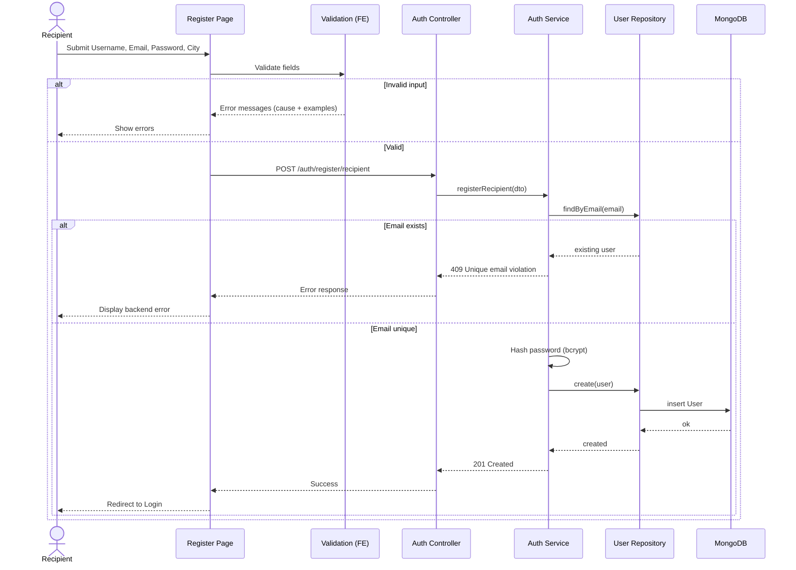
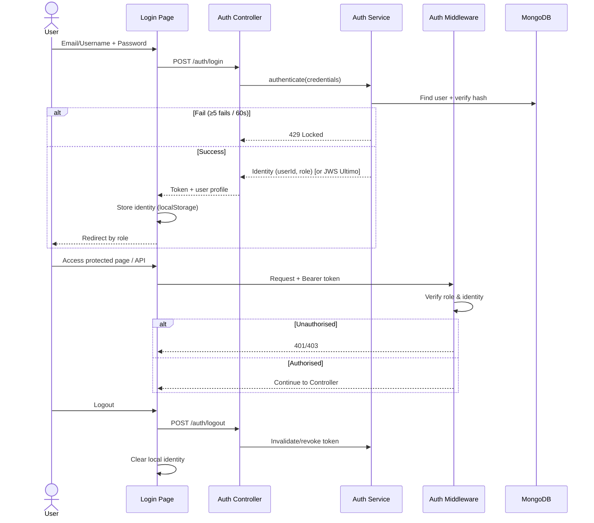
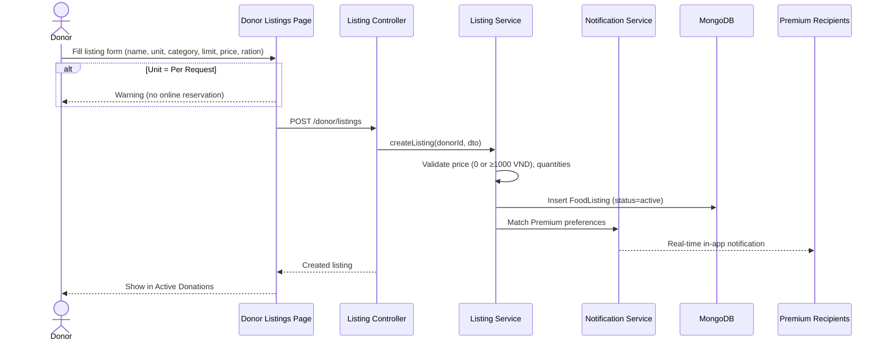
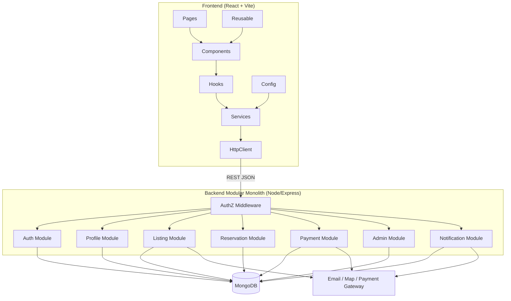
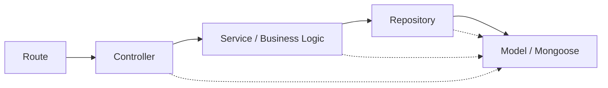
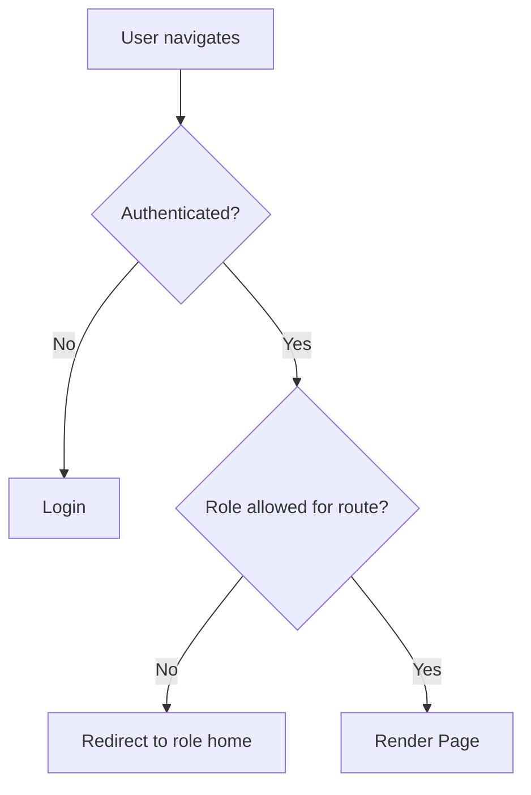
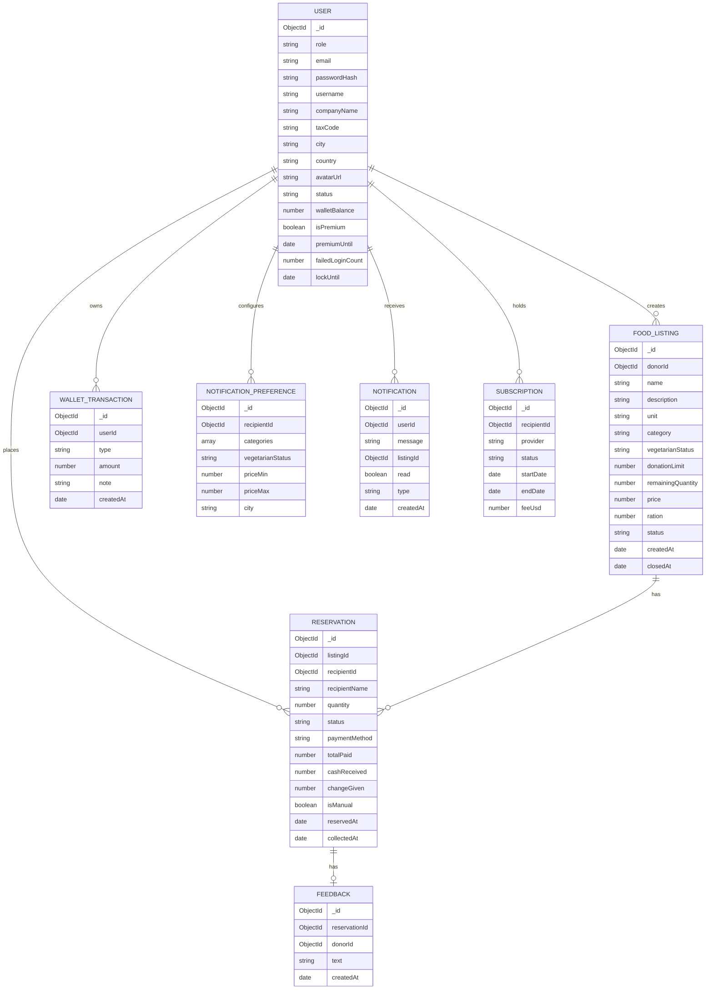
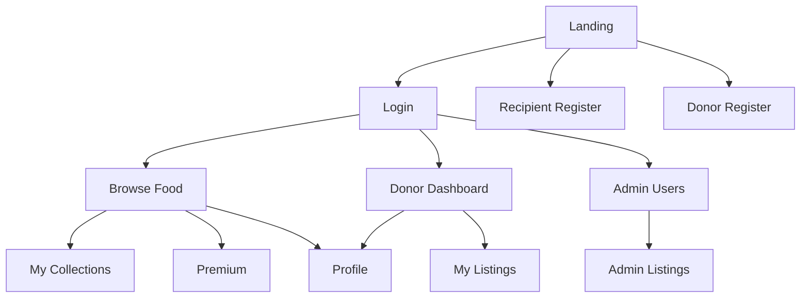

# COSC2769 – Full Stack Development  
## Milestone 1: Application Design and Implementation Report  
### Affordable Food Federation (AFF) — A Food Waste Reliever Platform

**Course:** COSC2769 – Full Stack Development  
**Institution:** RMIT University  
**Document Version:** 1.0  
**Date:** August 2026  

| Role | Full Name | Student ID | GitHub Username |
|------|-----------|------------|-----------------|
| Member 1 | *[Fill in]* | *[Fill in]* | *[Fill in]* |
| Member 2 | *[Fill in]* | *[Fill in]* | *[Fill in]* |
| Member 3 | *[Fill in]* | *[Fill in]* | *[Fill in]* |
| Member 4 | *[Fill in]* | *[Fill in]* | *[Fill in]* |

> **Note:** Cover page and Table of Contents do not count toward the 25-page limit. Replace placeholders before Canvas submission. Export this Markdown to PDF/Word and insert diagram screenshots from Lucidchart / Draw.io / Mermaid Live if required by the lecturer.

---

## Table of Contents

1. [Introduction](#1-introduction)  
2. [Project Description](#2-project-description)  
3. [Implementation Details](#3-implementation-details)  
4. [Sequence Diagram](#4-sequence-diagram)  
5. [Architecture Overview](#5-architecture-overview)  
6. [Data Model](#6-data-model)  
7. [UI/UX Design](#7-uiux-design)  
8. [Known Issues or Limitations](#8-known-issues-or-limitations)  
9. [Conclusion](#9-conclusion)  
10. [References](#10-references)  
11. [AI Acknowledgement](#11-ai-acknowledgement)  
12. [Appendix](#12-appendix)

---

## 1. Introduction

Food waste and food insecurity coexist as a global paradox. According to the UNEP Food Waste Index Report 2024, approximately **1.05 billion tonnes** of food were wasted in 2022 (about **19%** of food available to consumers), while roughly **783 million people** faced hunger in the same period [1]. Households alone account for a large share of this waste, meaning edible surplus often never reaches people who need it.

In Vietnam and similar urban contexts, surplus food from markets, bakeries, and restaurants is frequently discarded at the end of the day, while low-income individuals struggle to access affordable nutrition. There is a clear need for a digital intermediary that:

- Allows businesses to list surplus food quickly (free or low-cost).
- Allows recipients to discover, reserve, and collect food near them.
- Provides administration tools to keep the platform trustworthy.
- Optionally rewards engaged recipients with premium notification features.

**Affordable Food Federation (AFF)** is proposed as a web-based food redistribution platform that connects **Donors** (businesses) with **Recipients** (individuals experiencing financial hardship), under oversight by **Admins**.

This Milestone 1 report documents the **application design**: problem framing, planned features, technology choices, architecture, data model, sequence flows, and UI/UX. Milestone 2 will complete full-stack implementation (MEN stack + React) and deployment.

### 1.1 Report Objectives

- Analyse SRS functional and architecture requirements (Simplex / Medium / Ultimo).
- Justify the chosen tech stack and layering strategy.
- Present sequence diagrams for core business flows.
- Define the MongoDB-oriented data model.
- Describe UI/UX structure mapped to user roles.
- Identify known limitations and risks for Milestone 2.

### 1.2 Scope of Milestone 1

| In scope | Out of scope (Milestone 2+) |
|----------|-----------------------------|
| System design & architecture | Full backend persistence & production APIs |
| Data model & sequence diagrams | Cloud deployment (e.g., Render) |
| UX/UI design & interactive frontend prototype | Real Stripe/PayPal settlement |
| Frontend layer structure (Page → Component → Hook → Service) | Live WebSocket production hardening |
| Validation rules & role-based page protection (prototype) | Gold dataset fully loaded in MongoDB |

---

## 2. Project Description

### 2.1 Product Vision

AFF is a **Food Waste Reliever Platform** that redistributes surplus food from donors to recipients. Donors list food with quantity, unit, category, optional price, and ration limits. Recipients browse active listings, reserve (when eligible), pay via cash / wallet / card (as level allows), and leave feedback. Premium recipients receive preference-based real-time alerts. Admins manage accounts and can cancel listings.

### 2.2 User Roles

| Role | Description | Key capabilities |
|------|-------------|------------------|
| **Recipient** | Individual seeking free/affordable food | Register, browse, reserve, pay, history, feedback, premium |
| **Donor** | Business donating or selling affordably | Register (tax code), create/manage listings, manual give-out, stats |
| **Admin** | Platform operator | View users, deactivate/reactivate, cancel listings, search listings |

### 2.3 Feature Groups (aligned with SRS)

1. **1A / 1B Registration** — Recipient and Donor forms with uniqueness, hashing (backend), city dropdown (Vietnam only), and validation.  
2. **Login** — Authenticate by email/username + password; identity for API authorisation (session/token → JWS at Ultimo).  
3. **Profile Management** — Edit contact info; upload/resize logo/avatar (Medium).  
4. **Donor – Food Donation Management** — Create listings, Active/Past views, duplicate config, manual donation with change calculation, pause/resume/cancel, ration, search/filter/sort, notifications & charts (Ultimo).  
5. **Recipient – Food Collection Management** — Browse, reserve under SRS rules, payment methods, history, search/filter/sort, feedback, premium prefs, maps, location priority (Ultimo).  
6. **Premium Subscription** — Wallet deposit + $5 USD/month simulation; third-party payment at Medium.  
7. **Admin Functionality** — User list, activate/deactivate, cancel listings, listing search (Ultimo).  
8. **Additional Feature** — Team enhancement (Simplex/Medium/Ultimo); proposed options listed in Appendix C.

### 2.4 Target Complexity Level

The team targets **Medium** architecture and features as the baseline, with selected **Ultimo** UI/flows designed in Milestone 1 (charts, premium prefs UI, map link, role-based routes) so Milestone 2 can extend without redesign.

**Rationale:** Medium modular monolith + middleware + frontend REST helper/config/role guards match course rubrics while remaining deliverable in one semester. Ultimo items (JWS revocation, DTO boundaries, real-time sockets, modular packages) are designed into the architecture and partially prototyped on the frontend.

---

## 3. Implementation Details

### 3.1 Technology Stack

| Layer | Technology | Justification |
|-------|------------|---------------|
| Frontend | **React + Vite** | Required React-based option; fast HMR, modern tooling |
| Styling | **Tailwind CSS v4** | Utility-first, responsive Admin/Profile UIs (A.3.c) |
| Routing | **React Router v7** | Role-based page navigation |
| Charts | **Recharts** | Donor statistical reports (4.3.2) |
| Icons | **Lucide React** | Consistent lightweight icons |
| Backend (M2) | **Node.js + Express** | Course MEN requirement |
| Database (M2) | **MongoDB** | Flexible documents for listings/reservations |
| Auth (planned) | **bcrypt** hashing + **JWT/JWS** | Password hashing ≠ encryption (SRS); Ultimo JWS |
| Deployment (M2) | Local (Simplex) → **Render** (Medium) | Matches D.1.1 / D.2.1 |

### 3.2 Frontend Layer Hierarchy (A.1.3 / A.2.a–c)

```
src/
├── pages/                 # Page layer (screens)
├── components/            # Feature & layout components
│   └── reusable/          # Shared UI (Button, Input, Card, Modal…)
├── hooks/                 # Event/state hooks (e.g., useAuth)
├── services/              # REST HTTP helper (httpClient)
├── config/                # API routes grouped by domain
├── constants/             # Cities, categories, roles, units
├── utils/                 # Validation & formatters
├── data/                  # Mock / Gold dataset for UI demo
└── layouts/               # MainLayout (Navbar + Outlet + Footer)
```

- **Page:** composes components and calls hooks/services.  
- **Component:** presentation only where possible; handlers in hooks.  
- **Reusable components:** shared styling to avoid duplication.  
- **Config:** `apiRoutes.js` groups auth, profile, donor, recipient, admin, notifications.  
- **HTTP helper:** `HttpClient` supports GET/POST/PUT/PATCH/DELETE and returns `{ data, status, headers, ok }`.  
- **Authorisation (frontend):** `ProtectedRoute` blocks Donor/Recipient from Admin pages and redirects by role.

### 3.3 Backend Layer Hierarchy (planned for Milestone 2 — A.1.2 / A.2.1–A.2.3)

**N-Tier inside each module:**

`Route → Controller → Service → Repository → Model`

**Modular Monolith modules (bounded contexts):**

| Module | Responsibility |
|--------|----------------|
| `auth` | Register, login, logout, brute-force guard, JWT |
| `profile` | Profile update, avatar resize |
| `listing` | Donor create/update status, search |
| `reservation` | Recipient reserve, quantity rules |
| `payment` | Wallet, subscription, card gateway stubs |
| `admin` | User status, cancel listing |
| `notification` | In-app (+ email for premium payment) |

**Middleware:** role-based authorisation on every protected API (prevent privilege escalation).

### 3.4 Current Prototype Status

An interactive **React UI prototype** is implemented with:

- Landing, Login (demo accounts), Recipient/Donor registration with client-side validation  
- Profile (edit + avatar upload preview)  
- Donor dashboard (Recharts) + listings CRUD UI (pause/resume/cancel, duplicate, manual give)  
- Recipient browse/reserve/history/feedback  
- Premium wallet + preferences UI  
- Admin users & listings tables  

Persistence currently uses **mock data / localStorage** for Milestone 1 demonstration. Backend wiring is prepared via `apiRoutes` + `httpClient`.

### 3.5 Validation Rules (1A / 1B)

Implemented on the frontend (Ultimo requires duplicate enforcement on backend in M2):

| Field | Rule |
|-------|------|
| Email | One `@`, ≥1 `.` after `@`, length &lt; 255, no spaces / `() ; :` |
| Password | ≥8 chars, 1 digit, 1 special, 1 uppercase |
| Username | English letters, digits, `_`, `-` only |
| Company name | Vietnamese letters, digits, space, hyphen |
| Tax code | 10–13 digits |
| City | Dropdown of Vietnam cities/municipalities only |

Error messages describe **error, cause, and valid examples**.

### 3.6 Development Methodology

- Iterative approach (SCRUM-style sprints).  
- GitHub repository + Project board (lecturer invited).  
- Frequent commits of partial deliverables.  
- Sprint Review + Retrospective per cycle; meetings at Weeks 2 / 5 / 11 as required.

---

## 4. Sequence Diagram

This section presents key runtime interactions. Diagrams are shown in Mermaid (export to image for Word/PDF submission).

### 4.1 Recipient Registration



### 4.2 Login and Authorisation



### 4.3 Donor Creates Food Listing



### 4.4 Recipient Reserves Food

```mermaid
sequenceDiagram
    actor R as Recipient
    participant UI as Browse Page
    participant API as Reservation Controller
    participant S as Reservation Service
    participant DB as MongoDB

    R->>UI: Select listing + quantity + payment method
    UI->>API: POST /recipient/listings/{id}/reserve
    API->>S: reserve(recipientId, listingId, qty, payment)
    S->>DB: Load listing (active, not paused/cancelled)
    S->>S: Check unit ≠ Per Request
    S->>S: Check remaining ≥ 1 unit & qty ≤ remaining & ≤ ration
    S->>S: Check recipient has no existing reservation on listing
    alt Rule violated
        S-->>API: 400 with reason
        API-->>UI: Error
    else OK
        S->>DB: Create Reservation; decrease remaining
        alt remaining < 1 unit
            S->>DB: Mark listing sold_out / close reservations
            S-->>Donor: Sold-out notification (Ultimo)
        end
        S->>DB: Record payment method
        API-->>UI: Success
        UI-->>R: Confirmation
    end
```

### 4.5 Admin Cancels Listing

```mermaid
sequenceDiagram
    actor A as Admin
    participant UI as Admin Listings
    participant API as Admin Controller
    participant S as Admin Service
    participant N as Notification Service
    participant DB as MongoDB

    A->>UI: Cancel listing
    UI->>API: PATCH /admin/listings/{id}/cancel
    API->>S: cancelListing(id)
    S->>DB: Set status=cancelled; cancel active reservations
    S->>N: Notify affected Recipients (real-time, no refresh)
    API-->>UI: Updated status
    UI-->>A: Confirmation message
```

---

## 5. Architecture Overview

### 5.1 High-Level System Architecture



### 5.2 N-Tier Backend Inside a Module



- **Presentation (Route/Controller):** HTTP mapping, status codes, DTO shaping (Ultimo).  
- **Business Logic (Service):** reservation rules, wallet debit, pause/cancel side effects.  
- **Repository:** all query execution (reuse, separation from controllers).  
- **Model:** schema definitions and document shape.

Cross-module calls at Ultimo level must go through **module interfaces**, not direct Service imports of another module (A.3.1).

### 5.3 Frontend Authorisation Flow



Role homes:

- Admin → `/admin/users`  
- Donor → `/donor/dashboard`  
- Recipient → `/recipient/browse`

### 5.4 Architecture Requirement Mapping

| ID | Requirement | Design response |
|----|-------------|-----------------|
| A.1.1–A.1.4 | N-Tier FE/BE, Repository, reusable UI, global config | Folder hierarchy + Repository plan + reusable/ + config/ |
| A.2.1–A.2.3 | Modular monolith + layer access + middleware | Modules table + middleware on APIs |
| A.2.a–c | API config, HTTP helper, role page auth | `apiRoutes`, `HttpClient`, `ProtectedRoute` |
| A.3.a–d | Modular packages, loose hooks, responsive Admin/Profile | Planned package split; Profile & Admin responsive Tailwind |

---

## 6. Data Model

MongoDB collections are designed around documents with clear ownership and references by `ObjectId` / business IDs.

### 6.1 Entity–Relationship Overview



### 6.2 Key Fields and Constraints

**User**

- `email` unique index across all roles.  
- `role ∈ {recipient, donor, admin}`.  
- `status ∈ {active, inactive}` — inactive cannot login.  
- Recipient: `username`; Donor: `companyName`, `taxCode` (10–13 digits).  
- `passwordHash` only (never plaintext; hashing, not encryption).  
- `city` from Vietnam municipality set; `country` default `Vietnam`.

**FoodListing**

- `unit ∈ {kg, g, L, ml, unit, per_request}`.  
- `category ∈ {Fruit, Vegetable, Meat, Cooked Dish, Baked Goods, Drink}`.  
- `price = 0` (free) or integer `≥ 1000` VND.  
- `donationLimit` / `remainingQuantity` support decimals.  
- `status ∈ {active, paused, cancelled, sold_out}`.  
- Online reservation allowed only if active, not paused/cancelled, unit ≠ `per_request`, remaining ≥ 1 unit.

**Reservation**

- `status ∈ {reserved, collected, cancelled_recipient, cancelled_donor}`.  
- At most one open reservation per (recipient, listing) for online flow.  
- `quantity ≤ ration` and `≤ remainingQuantity`.  
- Manual donor give-out sets `isManual=true` and may store cash/change.

### 6.3 Indexes (planned)

| Collection | Index | Purpose |
|------------|-------|---------|
| users | `{ email: 1 }` unique | 1A.1.2 / 1B.1.2 |
| food_listings | `{ status: 1, createdAt: -1 }` | Browse active |
| food_listings | `{ donorId: 1, createdAt: -1 }` | Donor list |
| food_listings | `{ name: "text", category: 1 }` | Search/filter |
| reservations | `{ listingId: 1, recipientId: 1 }` | Duplicate reserve check |
| notifications | `{ userId: 1, read: 1, createdAt: -1 }` | Inbox |

### 6.4 Example Document (Food Listing)

```json
{
  "_id": "ObjectId(...)",
  "donorId": "ObjectId(...)",
  "name": "Day-old Bread & Pastries",
  "description": "Quality baked goods at affordable price",
  "unit": "unit",
  "category": "Baked Goods",
  "vegetarianStatus": "yes",
  "donationLimit": 40,
  "remainingQuantity": 18,
  "price": 5000,
  "ration": 5,
  "status": "active",
  "createdAt": "2026-08-02T06:30:00.000Z",
  "closedAt": null
}
```

---

## 7. UI/UX Design

### 7.1 Design Goals

1. **Role clarity** — navigation and dashboards differ by Recipient / Donor / Admin.  
2. **Trust & sustainability** — green primary palette communicating food rescue (not generic purple/AI clichés).  
3. **Task efficiency** — donors manage listings quickly; recipients filter and reserve in few steps.  
4. **Feedback quality** — validation messages include cause + examples (SRS Ultimo).  
5. **Responsive** — Profile and Admin tables usable on mobile (A.3.c).

### 7.2 Information Architecture



### 7.3 Screen Inventory

| Screen | Route | Primary users | SRS mapping |
|--------|-------|---------------|-------------|
| Landing | `/` | Public | Product introduction |
| Login | `/login` | All | Feature 2 (+ demo accounts) |
| Recipient Register | `/register/recipient` | Public | 1A |
| Donor Register | `/register/donor` | Public | 1B |
| Profile | `/profile` | Donor/Recipient | 3 |
| Donor Dashboard | `/donor/dashboard` | Donor | 4.3.2 charts |
| Donor Listings | `/donor/listings` | Donor | 4.x |
| Browse Food | `/recipient/browse` | Recipient | 5.1–5.2, map link 5.3.4 |
| Collections | `/recipient/history` | Recipient | 5.1.4, 5.2.4 |
| Premium | `/premium` | Recipient | 6, 5.3.1 |
| Admin Users | `/admin/users` | Admin | 7.1–7.2 |
| Admin Listings | `/admin/listings` | Admin | 7.2.2, 7.3 |

### 7.4 Visual Design System

| Token | Value / usage |
|-------|----------------|
| Primary green | `#16a34a` / `#15803d` — CTAs, brand AFF |
| Accent orange | `#f97316` — secondary CTAs (e.g., need food / donor actions) |
| Neutrals | Slate text & borders for readability |
| Components | Button, Input, Select, Card, Badge, Modal, Alert, Avatar, StatCard |
| Typography | Clean UI sans for forms/tables; clear hierarchy H1 → body → hints |

### 7.5 Key UX Flows

**Recipient happy path:** Register → Login → Browse (filter city/category/price) → Reserve → Choose payment → Collect → Feedback.

**Donor happy path:** Register → Login → Create listing → Monitor Active/Past → Pause/Resume/Cancel → Manual give-out (change calculation) → View dashboard charts.

**Admin happy path:** Login → Search users → Deactivate abusive account → Search listings → Cancel unsafe listing → Recipients notified.

### 7.6 Accessibility & Usability Notes

- Required fields marked; errors adjacent to inputs.  
- Demo credential chips on Login for Milestone demos (not for production).  
- Empty states when no listings/collections.  
- Tables scroll horizontally on small screens.  
- Map access via OpenStreetMap search link (no paid Map SDK required).

### 7.7 Prototype Wire / Screenshot Placeholders

*[Insert screenshots here before submission]*

1. Landing hero with dual CTAs  
2. Recipient registration validation states  
3. Donor create listing + Per Request warning  
4. Recipient browse cards + reserve modal  
5. Donor dashboard charts  
6. Admin users table (desktop + mobile)  
7. Premium wallet & preferences  

---

## 8. Known Issues or Limitations

| # | Issue / Limitation | Impact | Mitigation (M2) |
|---|--------------------|--------|-----------------|
| 1 | Backend APIs not fully connected; UI uses mock data | No durable multi-user sync | Implement MEN modules + repositories |
| 2 | Auth token is demo string, not signed JWS | Not production-secure | Issue JWT/JWS; revoke on logout (2.3.x) |
| 3 | Password hashing only planned server-side | Prototype login skips real hash verify | bcrypt in Auth Service |
| 4 | Avatar resize not server-processed | Large images possible | Sharp/multer resize pipeline (3.2.1) |
| 5 | Real-time notifications UI-only | No live push yet | Socket.IO / SSE + audible alert |
| 6 | Stripe/PayPal not integrated | Card pay is UI stub | Medium gateway + webhook |
| 7 | Email on premium payment simulated | No SMTP | Nodemailer / provider |
| 8 | Geolocation priority not device-based yet | City sort only | Browser geolocation API (5.3.3) |
| 9 | Brute-force lockout not live | Security gap | Redis/memory counter (2.2.1) |
| 10 | Additional Feature (8.x) not finalised | Rubric risk | Select & implement one Medium+ enhancement |
| 11 | Vietnam city list is curated subset | Not every municipality | Expand from official list if needed |
| 12 | Concurrent reservation race conditions | Overbooking risk | Atomic Mongo updates / transactions |

---

## 9. Conclusion

Milestone 1 establishes a coherent design for the **Affordable Food Federation** platform: clear roles, SRS-aligned features, N-tier and modular monolith architecture, MongoDB data model, sequence diagrams for critical flows, and a React UI prototype that demonstrates registration, login, donation management, reservation, premium, and admin screens.

The design intentionally separates concerns (pages, reusable components, hooks, services, config) and prepares REST boundaries for Milestone 2. Known limitations are documented with concrete mitigations.

**Next steps for Milestone 2:**

1. Implement Express modular backend with Repository layer and AuthZ middleware.  
2. Persist Gold Dataset and demo accounts (Admin, 2 Premium Recipients, 1 Standard, 2 Donors).  
3. Connect frontend `httpClient` to live APIs; replace mocks.  
4. Deliver selected Ultimo items (JWS, real-time notifications, charts with live data).  
5. Deploy to cloud (Render) and prepare demo script.

---

## 10. References

[1] United Nations Environment Programme (UNEP), *Food Waste Index Report 2024* / related UNEP communication: “World squanders over 1 billion meals a day,” 2024.  

[2] RMIT University, *COSC2769 – Full Stack Development, Software Requirements Specification (AFF)*, Version 1.1, 2026.  

[3] React Documentation, https://react.dev/  

[4] Vite Documentation, https://vite.dev/  

[5] Express.js Documentation, https://expressjs.com/  

[6] MongoDB Manual, https://www.mongodb.com/docs/manual/  

[7] Tailwind CSS Documentation, https://tailwindcss.com/docs  

[8] OWASP Authentication Cheat Sheet (password hashing & brute-force guidance), https://cheatsheetseries.owasp.org/  

[9] OpenStreetMap, https://www.openstreetmap.org/  

[10] Recharts Documentation, https://recharts.org/  

---

## 11. AI Acknowledgement

The team used **AI coding assistants** (including Cursor) as support tools during Milestone 1 for:

- Drafting and refining UI components and report structure.  
- Generating Mermaid diagram skeletons and validating consistency with the SRS.  
- Suggesting validation messages and folder organisation aligned with N-tier guidance.

**Human responsibility:** All design decisions (architecture level, feature scope, data model relationships, UX flows) were reviewed, edited, and owned by the team. Code and diagrams were checked against the official SRS. AI output was not submitted blindly; members can explain rationale for data model, architecture, and UI in the Milestone 1 interview.

We acknowledge that AI assistance does not replace understanding of course concepts, and each member remains accountable for their declared contributions on GitHub and the Contribution Declaration Sheet.

---

## 12. Appendix

### Appendix A — Demo Accounts (Gold Dataset Plan)

| Label | Email | Role | Notes |
|-------|-------|------|-------|
| Admin | admin@aff.vn | Admin | Administration portal |
| Donor (Free) | greenmarket@aff.vn | Donor | Free listings only |
| Donor (Paid) | freshbakery@aff.vn | Donor | Affordable priced listings |
| Premium Recipient | lan.nguyen@email.vn | Recipient | Active premium + preferences |
| Standard Recipient | minh.tran@email.vn | Recipient | No premium |

All accounts will have avatar images uploaded for Milestone 2 demo.

### Appendix B — Frontend Route Map

| Path | Guard |
|------|-------|
| `/` | Public |
| `/login`, `/register/*` | Public |
| `/profile` | Recipient, Donor |
| `/donor/*` | Donor |
| `/recipient/*`, `/premium` | Recipient |
| `/admin/*` | Admin |

### Appendix C — Proposed Additional Feature (Feature 8)

**Candidate (Medium):** Donor “impact summary” export — weekly PDF/CSV of donated quantity and revenue by category (custom UI + aggregation queries).  

**Candidate (Ultimo):** Live multi-recipient notification room when a matching listing is posted (WebSocket + preference engine).  

*Team to confirm final choice before Milestone 2 coding freeze.*

### Appendix D — Contribution Snapshot (fill before submit)

| Member | Design / Diagrams | UI/UX | Frontend code | Backend (M2) | Report writing |
|--------|-------------------|-------|---------------|--------------|----------------|
| 1 | | | | | |
| 2 | | | | | |
| 3 | | | | | |
| 4 | | | | | |

Attach GitHub contribution evidence as required by the course (P2).

### Appendix E — How to Run the UI Prototype

```bash
cd aff-platform
npm install
npm run dev
```

Open the local Vite URL (typically `http://localhost:5173`). Use Login demo account chips to explore each role.

### Appendix F — Glossary

| Term | Meaning |
|------|---------|
| AFF | Affordable Food Federation |
| Ration | Max quantity one person may reserve for a listing |
| Per Request | Unit without online reservation |
| Gold Data Set | Preloaded demo data for Milestone 2 presentation |
| JWS | JSON Web Signature token for API authorisation |

---

**End of Milestone 1 Report**
